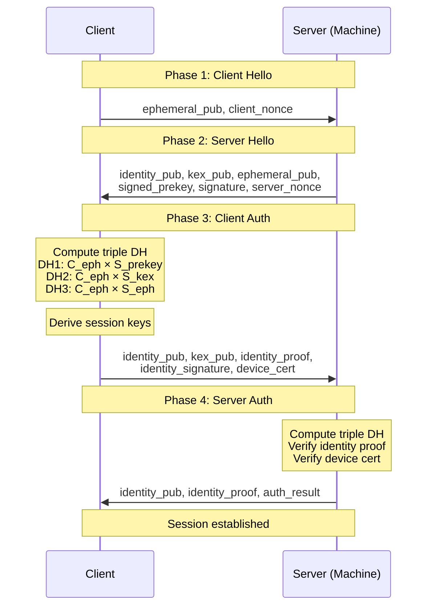
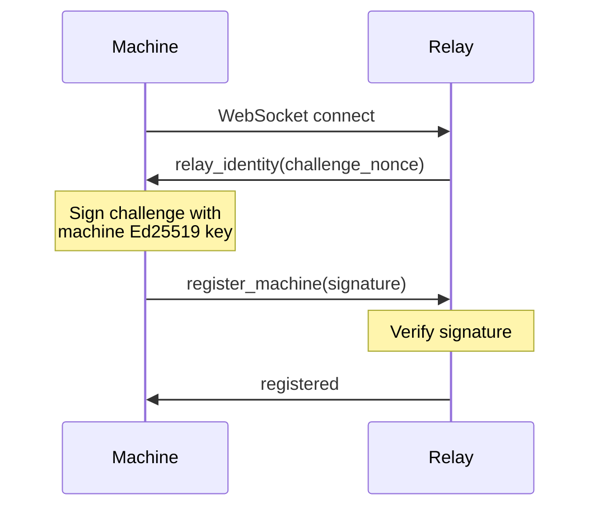

GitSpace implements end-to-end encryption for all remote terminal sessions and configuration sync. The relay server can route traffic but cannot decrypt any sensitive data.

## Cryptographic Primitives

GitSpace uses modern, audited cryptographic libraries:

| Purpose | Algorithm | Library | Key Size |
|---------|-----------|---------|----------|
| Identity signing | Ed25519 | @noble/curves | 256 bits |
| Key exchange | X25519 | @noble/curves | 256 bits |
| Symmetric encryption | AES-256-GCM | node:crypto | 256 bits |
| Key derivation | HKDF-SHA256 | @noble/hashes | Variable |
| Relay authentication | Ed25519 challenge-response | @noble/curves | 256 bits |

<Note>
All cryptographic implementations are from the [@noble](https://paulmillr.com/noble/) suite, which are audited, well-tested, and used by major cryptocurrency projects.
</Note>

## Identity System

### Identity Types

GitSpace uses three types of cryptographic identities:

<Tabs>
  <Tab title="User Root Identity">
    **User Root Identity** is the top-level owner credential.

    **Derivation**:
    ```
    BIP39 24-word mnemonic
      ↓ PBKDF2
    64-byte seed
      ↓ HKDF-SHA256("gitspace", "user-signing")
    Ed25519 signing keypair
      ↓ HKDF-SHA256("gitspace", "user-keyexchange")
    X25519 key exchange keypair
    ```

    **Properties**:
    - Deterministically derived from mnemonic
    - Mnemonic NEVER stored (only in memory during setup)
    - Used to sign device certificates
    - Identifies owner across all devices
  </Tab>

  <Tab title="Device Identity">
    **Device Identity** represents a client device (CLI or web).

    **Generation**:
    - Ed25519 signing keypair (randomly generated)
    - X25519 key exchange keypair (randomly generated)
    - Device certificate signed by user root identity

    **Properties**:
    - One per client device
    - Certified by user root
    - Used for X3DH handshakes
    - Can be revoked via certificate expiry
  </Tab>

  <Tab title="Machine Identity">
    **Machine Identity** represents a server machine.

    **Generation**:
    - Ed25519 signing keypair (randomly generated)
    - X25519 key exchange keypair (randomly generated)
    - Enrolled via relay-machine invite

    **Properties**:
    - One per machine
    - Bound to owner via enrollment
    - Used for relay authentication
    - Used for X3DH handshakes
  </Tab>
</Tabs>

### Identity ID Derivation

All identity IDs are derived from the Ed25519 signing public key:

```typescript
// src/lib/tmux-lite/crypto/identity.ts
export function deriveIdentityId(signingPublicKey: Uint8Array): string {
  const base64url = Buffer.from(signingPublicKey).toString("base64url");
  return base64url.slice(0, 16); // First 16 chars
}
```

**Properties**:
- 16 character base64url string
- Collision probability: ~1 in 2^96
- URL-safe and compact
- Deterministically derived from public key

## Ed25519 Digital Signatures

Ed25519 is used for:

1. **Identity proof** - Proving ownership of a private key
2. **Message authentication** - Signing relay protocol messages
3. **Device certificates** - User root signing device keys
4. **Relay authentication** - Machine signing challenge nonces

### Signing Process

```typescript
// src/lib/tmux-lite/crypto/identity.ts
export function sign(message: Uint8Array, secretKey: Uint8Array): Uint8Array {
  const privateKey = secretKey.slice(0, 32); // Extract 32-byte private key
  return ed25519.sign(message, privateKey);  // Returns 64-byte signature
}
```

### Verification Process

```typescript
// src/lib/tmux-lite/crypto/identity.ts
export function verify(
  message: Uint8Array,
  signature: Uint8Array,
  publicKey: Uint8Array
): boolean {
  return ed25519.verify(signature, message, publicKey);
}
```

<Accordion title="Ed25519 Security Properties">
- **Deterministic**: Same message + key = same signature
- **Non-malleable**: Cannot modify signature without detection
- **Fast**: ~100,000 verifications per second
- **Collision-resistant**: Infeasible to find two messages with same signature
- **Small signatures**: 64 bytes
</Accordion>

## X25519 Key Exchange

X25519 is used for Diffie-Hellman key exchange to establish shared secrets.

### ECDH Shared Secret

```typescript
// src/lib/tmux-lite/crypto/keyexchange.ts
export function x25519SharedSecret(
  privateKey: Uint8Array,
  publicKey: Uint8Array
): Uint8Array {
  return x25519.getSharedSecret(privateKey, publicKey);
}
```

**Properties**:
- Output: 32-byte shared secret
- Same result from both sides: `DH(a_priv, B_pub) = DH(b_priv, A_pub)`
- Computationally infeasible to derive private key from public key
- Resistant to quantum attacks (post-quantum variants exist)

### Key Derivation

Shared secrets are never used directly. They're passed through HKDF:

```typescript
// src/lib/tmux-lite/crypto/keyexchange.ts
export function deriveSessionKeys(
  sharedSecret: Uint8Array,
  salt: Uint8Array,
  isInitiator: boolean
): SessionKeys {
  // Derive 64 bytes of key material
  const keyMaterial = hkdf(sha256, sharedSecret, salt, "gitspace-session", 64);
  
  // Split into send/receive keys based on role
  const sendKey = isInitiator 
    ? keyMaterial.slice(0, 32)   // Initiator sends with first half
    : keyMaterial.slice(32, 64); // Responder sends with second half
    
  const receiveKey = isInitiator
    ? keyMaterial.slice(32, 64)  // Initiator receives with second half
    : keyMaterial.slice(0, 32);  // Responder receives with first half
    
  return { sendKey, receiveKey, sessionId: "..." };
}
```

<Warning>
The `isInitiator` parameter ensures both parties derive complementary send/receive keys. Getting this wrong means encrypted data cannot be decrypted.
</Warning>

## X3DH Handshake Protocol

X3DH (Extended Triple Diffie-Hellman) provides:

- **Perfect forward secrecy** - Compromise of long-term keys doesn't reveal past sessions
- **Mutual authentication** - Both parties prove their identity
- **Deniability** - No proof that a party sent specific messages
- **Replay protection** - Nonces and timestamps prevent replay attacks

### Handshake Flow



### Triple Diffie-Hellman

The handshake uses three DH operations for maximum security:

```typescript
// Client side (src/lib/tmux-lite/crypto/handshake.ts)

// DH1: client_ephemeral × server_signed_prekey
const dh1 = x25519SharedSecret(
  state.ephemeral.privateKey,
  state.peerSignedPreKey
);

// DH2: client_ephemeral × server_identity_keyexchange
const dh2 = x25519SharedSecret(
  state.ephemeral.privateKey,
  state.peerKeyExchangeKey
);

// DH3: client_ephemeral × server_ephemeral
const dh3 = x25519SharedSecret(
  state.ephemeral.privateKey,
  state.peerEphemeralKey
);

// Combine all three secrets
const sessionKeys = deriveSessionKeysFromMultiple(
  [dh1, dh2, dh3],
  salt,
  true // Client is initiator
);
```

<Accordion title="Why Three DH Operations?">
1. **DH1 (ephemeral × signed_prekey)**: Provides authentication (signed prekey proves server identity)
2. **DH2 (ephemeral × identity_key)**: Binds session to server's long-term identity
3. **DH3 (ephemeral × ephemeral)**: Provides forward secrecy (ephemeral keys are discarded)

Compromise of any single key doesn't compromise the session.
</Accordion>

### Identity Proof

Both parties prove identity with HMAC over the transcript:

```typescript
// Create identity proof (src/lib/tmux-lite/crypto/handshake.ts)
const transcript = new Uint8Array(
  clientNonce.length + serverNonce.length
);
transcript.set(clientNonce, 0);
transcript.set(serverNonce, clientNonce.length);

const identityProof = createHmac("sha256", sessionKeys.sendKey)
  .update(transcript)
  .digest();
```

**Properties**:
- Binds identity to session keys (can't reuse for different session)
- Includes both nonces (prevents replay)
- Uses session-derived key (proves DH computation)

### Device Certificate Verification

Clients must present a valid device certificate signed by the user root:

```typescript
// Verify device certificate (src/lib/tmux-lite/crypto/device-cert.ts)
export function verifyDeviceCertificate(cert: DeviceCertificate): boolean {
  // Reconstruct signed payload
  const payload = new Uint8Array(/* ... */);
  // domain || deviceSigningPubKey || deviceKexPubKey || issuedAt || expiresAt
  
  const signature = Buffer.from(cert.signature, 'base64');
  const userRootPub = Buffer.from(cert.userRootSigningPublicKey, 'base64');
  
  return verify(payload, signature, userRootPub);
}
```

## AES-256-GCM Encryption

Once session keys are established, all data is encrypted with AES-256-GCM.

### Encryption Process

```typescript
// src/lib/tmux-lite/crypto/secretbox.ts
export function encrypt(
  data: Uint8Array | Buffer,
  key: Uint8Array | Buffer
): { nonce: Buffer; ciphertext: Buffer } {
  const nonce = randomBytes(12); // 96-bit nonce for GCM
  
  const cipher = createCipheriv("aes-256-gcm", key, nonce, {
    authTagLength: 16, // 128-bit auth tag
  });
  
  const encrypted = Buffer.concat([cipher.update(data), cipher.final()]);
  const authTag = cipher.getAuthTag();
  
  // Append auth tag to ciphertext
  const ciphertext = Buffer.concat([encrypted, authTag]);
  
  return { nonce, ciphertext };
}
```

### Decryption Process

```typescript
// src/lib/tmux-lite/crypto/secretbox.ts
export function decrypt(
  ciphertext: Uint8Array | Buffer,
  nonce: Uint8Array | Buffer,
  key: Uint8Array | Buffer
): Buffer | null {
  // Extract auth tag from end of ciphertext
  const encrypted = ciphertext.slice(0, -16);
  const authTag = ciphertext.slice(-16);
  
  const decipher = createDecipheriv("aes-256-gcm", key, nonce, {
    authTagLength: 16,
  });
  
  decipher.setAuthTag(authTag);
  
  try {
    return Buffer.concat([decipher.update(encrypted), decipher.final()]);
  } catch {
    return null; // Authentication failed
  }
}
```

<Note>
AES-256-GCM provides both confidentiality and authenticity. If the ciphertext or auth tag is tampered with, decryption will fail.
</Note>

## Encrypted Frame Format

Terminal data is transmitted in encrypted frames:

```
┌────────────┬────────────┬──────────────────────────────────────────────┐
│  streamId  │   nonce    │   encrypted payload + authTag (16 bytes)     │
│  4 bytes   │  12 bytes  │              variable length                 │
└────────────┴────────────┴──────────────────────────────────────────────┘
```

### Frame Creation

```typescript
// src/lib/tmux-lite/crypto/frames.ts
export function createFrame(
  streamId: number,
  data: Uint8Array | Buffer,
  key: Uint8Array | Buffer
): Buffer {
  const { nonce, ciphertext } = encrypt(data, key);
  
  const frame = Buffer.alloc(4 + 12 + ciphertext.length);
  frame.writeUInt32BE(streamId, 0);  // Stream ID
  nonce.copy(frame, 4);               // Nonce
  ciphertext.copy(frame, 16);         // Encrypted data + tag
  
  return frame;
}
```

### Frame Decryption

```typescript
// src/lib/tmux-lite/crypto/frames.ts
export function openFrame(
  frame: Buffer | Uint8Array,
  key: Uint8Array | Buffer
): { streamId: number; data: Buffer } | null {
  const streamId = frame.readUInt32BE(0);
  const nonce = frame.slice(4, 16);
  const ciphertext = frame.slice(16);
  
  const data = decrypt(ciphertext, nonce, key);
  if (!data) return null; // Authentication failed
  
  return { streamId, data };
}
```

### Stream IDs

| Stream ID | Purpose |
|-----------|----------|
| 0 | Master stream (full machine access) |
| 1+ | Session share streams (per-terminal access) |

## Relay Authentication

Machines authenticate to the relay using Ed25519 challenge-response:



### Challenge Signing

```typescript
// Machine side
const challenge = Buffer.from(relayIdentity.challenge, 'base64');
const signature = sign(challenge, machineIdentity.signing.secretKey);

const message: RegisterMachineMessage = {
  type: 'register_machine',
  machineId: machineIdentity.id,
  signingKey: Buffer.from(machineIdentity.signing.publicKey).toString('base64'),
  keyExchangeKey: Buffer.from(machineIdentity.keyExchange.publicKey).toString('base64'),
  challengeResponse: Buffer.from(signature).toString('base64'),
};
```

## Configuration Sync Encryption

Owner configuration data synced through the relay is encrypted:

```typescript
// Encrypt config for relay storage
const configData = JSON.stringify({
  projects: [...],
  integrations: {...},
  preferences: {...},
});

const ownerRootKey = deriveOwnerConfigKey(userRootIdentity);
const { nonce, ciphertext } = encrypt(
  Buffer.from(configData, 'utf-8'),
  ownerRootKey
);

const record: OwnerSyncRecord = {
  category: 'project/workspace',
  revision: 42,
  ciphertext: Buffer.from(ciphertext).toString('base64'),
  checksum: sha256(configData).toString('hex'),
  // ... metadata
};
```

<Warning>
The relay stores only the encrypted ciphertext and metadata. It cannot decrypt configuration values.
</Warning>

## Security Properties

### End-to-End Encryption

✅ **Protected**:
- Terminal input/output
- Configuration data (projects, secrets, preferences)
- Session commands and responses

❌ **Not Protected** (visible to relay):
- Machine IDs
- Connection IDs
- Sync record metadata (revision, timestamp, checksum)
- Message routing information

### Threat Model

<AccordionGroup>
  <Accordion title="Network Interception">
    **Mitigation**: TLS + X3DH forward secrecy
    
    Even if an attacker captures all network traffic:
    - TLS encrypts WebSocket transport
    - X3DH ephemeral keys provide forward secrecy
    - Past sessions remain secure even if long-term keys are compromised
  </Accordion>

  <Accordion title="Relay Compromise">
    **Mitigation**: E2E encryption + owner-decrypt-only envelopes
    
    If the relay server is compromised:
    - Cannot decrypt terminal content (E2E encrypted with X3DH keys)
    - Cannot decrypt config payloads (encrypted with owner root key)
    - Can only see routing metadata
  </Accordion>

  <Accordion title="Replay Attacks">
    **Mitigation**: Timestamped signatures + nonces
    
    Handshake messages include:
    - Client nonce (32 bytes random)
    - Server nonce (32 bytes random)
    - Timestamps with 5-minute skew tolerance
    - Fresh ephemeral keys per session
  </Accordion>

  <Accordion title="Man-in-the-Middle">
    **Mitigation**: Signed pre-keys + device certificates
    
    X3DH handshake includes:
    - Server signed pre-key (proves server identity)
    - Client device certificate (proves user authorization)
    - Identity signatures over handshake transcript
  </Accordion>
</AccordionGroup>

## Implementation Files

Key cryptography implementations:

| File | Purpose |
|------|----------|
| `crypto/identity.ts` | Ed25519/X25519 key generation and signing |
| `crypto/keyexchange.ts` | X25519 ECDH and session key derivation |
| `crypto/secretbox.ts` | AES-256-GCM encryption/decryption |
| `crypto/frames.ts` | Encrypted frame encoding/decoding |
| `crypto/handshake.ts` | X3DH protocol implementation |
| `crypto/device-cert.ts` | Device certificate verification |
| `crypto/user-identity.ts` | User root identity (BIP39 derivation) |
| `crypto/root-invites.ts` | Signed invite token creation |
| `crypto/access-control.ts` | ACL checking |

## Next Steps

<CardGroup cols={2}>
  <Card title="Protocol" icon="network-wired" href="/architecture/protocol">
    Learn about the relay protocol and message formats
  </Card>
  <Card title="Architecture Overview" icon="sitemap" href="/architecture/overview">
    Return to the system architecture overview
  </Card>
  <Card title="Security Model" icon="shield" href="/remote/security">
    Recommended security practices for deployment
  </Card>
  <Card title="Development" icon="code" href="/advanced/development">
    Set up a development environment
  </Card>
</CardGroup>