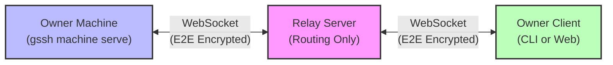
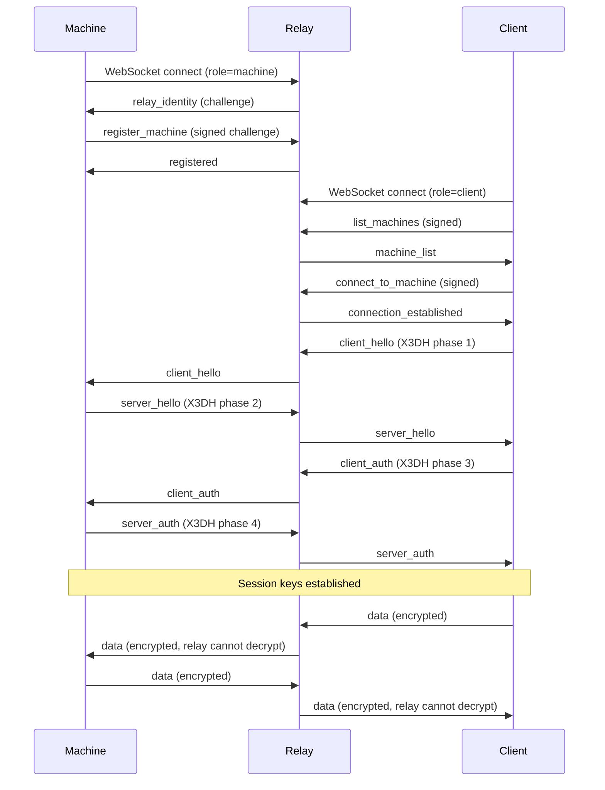

GitSpace is a CLI tool for managing GitHub repository workspaces using git worktrees, with secure remote terminal access via an end-to-end encrypted relay system.

## Core Concepts

GitSpace is built around five fundamental concepts:

### 1. Projects

**Projects** are top-level containers for a GitHub repository.

- **Location**: `~/gitspace/<project-name>/`
- **Contents**: Base repository clone, workspaces, project configuration
- **Purpose**: Organize all workspaces for a single repository

```bash
~/gitspace/my-project/
├── .git/                    # Base repository
├── .config.json            # Project configuration
└── workspaces/             # All worktrees live here
```

### 2. Workspaces

**Workspaces** are individual git worktrees for features or branches.

- **Location**: `~/gitspace/<project-name>/workspaces/<workspace-name>/`
- **Contents**: Git worktree with its own branch, workspace-specific files
- **Purpose**: Parallel development on multiple branches
- **Scripts**: Version-controlled scripts in `.gitspace/scripts/<phase>/`

```bash
~/gitspace/my-project/workspaces/feature-login/
├── .git                    # Worktree git link
├── src/                    # Feature code
├── .gitspace/              # Workspace configuration
│   └── scripts/            # Custom workspace scripts
│       ├── pre/
│       ├── setup/
│       ├── select/
│       └── remove/
└── gitspace.lock           # Workspace state marker
```

<Note>
Each workspace operates on its own branch, allowing you to work on multiple features simultaneously without switching contexts.
</Note>

### 3. Sessions

**Sessions** are PTY (pseudo-terminal) terminal sessions managed by tmux-lite.

- **Manager**: xterm-headless maintains terminal state on the server
- **Multi-attach**: Multiple clients can attach to the same session
- **Persistence**: Sessions survive client disconnections
- **Encryption**: All terminal I/O is end-to-end encrypted when remote

### 4. Identity

**Identity** is a cryptographic keypair per machine or client device.

<Tabs>
  <Tab title="Purpose">
    - **Ed25519**: Digital signatures for proving identity
    - **X25519**: Key exchange for establishing encryption
  </Tab>
  <Tab title="Storage">
    - `~/gitspace/.identity/keypair.json` - Encrypted identity keypair
    - `~/gitspace/.identity/machine.json` - Machine registration info
    - `~/gitspace/.identity/relay.json` - Relay configuration cache
    - `~/gitspace/.relay/control/control.db` - Relay/machine ACL + invites
  </Tab>
</Tabs>

**Identity Types**:

| Type | Purpose | Keys |
|------|---------|------|
| User Root | Top-level owner identity | Ed25519 + X25519 from BIP39 mnemonic |
| Device | Client device identity | Ed25519 + X25519, certified by user root |
| Machine | Server machine identity | Ed25519 + X25519, enrolled via invite |

### 5. Relay

**Relay** is a WebSocket server that routes encrypted traffic between machines and clients.

- **Purpose**: Connect machines to clients through NAT/firewalls
- **Security**: Cannot decrypt terminal content (E2E encryption)
- **Auth**: Ed25519 challenge-response authentication
- **Sync**: Stores encrypted owner configuration records



## System Architecture

GitSpace consists of multiple runtime components:

### Component Overview

<AccordionGroup>
  <Accordion title="CLI & TUI">
    - **Entry Point**: `src/index.ts`
    - **CLI Framework**: Commander.js for command parsing
    - **TUI Framework**: OpenTUI for terminal interface
    - **Commands**: 17 command modules in `src/commands/`
    - **Purpose**: User interaction layer
  </Accordion>

  <Accordion title="Core Business Logic">
    - **Location**: `src/core/`
    - **Modules**:
      - `config.ts` - Configuration management
      - `git.ts` - Git operations (worktrees, branches)
      - `identity.ts` - Machine identity management
      - `github.ts` - GitHub API via `gh` CLI
      - `linear.ts` - Linear API integration
      - `access.ts` - Access list management
      - `bundle.ts` - Project template bundles
      - `shell.ts` - Subshell spawning
  </Accordion>

  <Accordion title="tmux-lite (Terminal Multiplexer)">
    - **Location**: `src/lib/tmux-lite/`
    - **Purpose**: Manage terminal sessions with E2E encryption
    - **Components**:
      - `server.ts` - Session manager with xterm-headless
      - `cli.ts` - CLI interface
      - `protocol.ts` - Frame format (PTY/CONTROL)
      - `handshake-handler.ts` - X3DH handshake management
      - `relay-client.ts` - WebSocket client for relay
      - `crypto/` - Cryptography implementations
  </Accordion>

  <Accordion title="Relay Server">
    - **Location**: `src/relay/`
    - **Purpose**: Route encrypted traffic and enforce policy
    - **Components**:
      - `server.ts` - WebSocket routing server
      - `protocol.ts` - Message types and validation
      - `registries.ts` - Machine/invite/auth registries
      - `jwt.ts` - JWT token creation/verification
      - `pipes.ts` - Pipe abstraction for data routing
  </Accordion>

  <Accordion title="Machine Daemon">
    - **Location**: `src/serve/`
    - **Purpose**: Background service for remote access
    - **Components**:
      - `daemon.ts` - Daemon lifecycle (PID, status socket)
      - `client-session-manager.ts` - Client connection handling
      - `pty-session.ts` - PTY session management
  </Accordion>

  <Accordion title="Web Application">
    - **Location**: `src/` (web build separate)
    - **Framework**: React + Vite
    - **Terminal**: xterm.js for web terminal
    - **Crypto**: Same crypto libs as CLI (browser-compatible)
    - **Storage**: LocalStorage for identity
  </Accordion>
</AccordionGroup>

## Connection Flows

### Self-Hosted Relay Flow



### gitspace.sh Hosting Flow

<Steps>
  <Step title="User Authentication">
    User runs `gssh user auth login` to authenticate via GitHub OAuth
  </Step>
  <Step title="Subdomain Reservation">
    User runs `gssh user host reserve <name>` to reserve a subdomain on gitspace.sh
  </Step>
  <Step title="Machine Daemon">
    Machine runs `gssh machine serve start`, which auto-starts:
    - Local relay server
    - cloudflared tunnel to gitspace.sh
  </Step>
  <Step title="Client Connection">
    Client connects via web browser to `https://<name>.gitspace.sh`
  </Step>
  <Step title="X3DH Handshake">
    Client and machine complete X3DH handshake to establish session keys
  </Step>
  <Step title="Encrypted Communication">
    All terminal I/O is end-to-end encrypted, gitspace.sh cannot decrypt
  </Step>
</Steps>

<Warning>
The gitspace.sh relay can route traffic but cannot decrypt terminal content or configuration data. All sensitive data is encrypted end-to-end.
</Warning>

## Data Flow Architecture

### Local Operations

```
CLI Command
    ↓
Commands Layer (src/commands/)
    ↓
Core Business Logic (src/core/)
    ↓
Git Operations ← → File System
```

### Remote Terminal Access

```
Web/CLI Client
    ↓
Relay WebSocket (E2E encrypted frames)
    ↓
Machine Daemon (src/serve/)
    ↓
tmux-lite Session Manager
    ↓
PTY (xterm-headless)
    ↓
Shell Process
```

### Configuration Sync

```
Owner Device
    ↓
Local Config Cache
    ↓
Relay Sync Protocol (compare/pull/push)
    ↓
Relay Storage (encrypted records)
    ↓
Other Owner Devices
```

<Note>
All configuration data synced through the relay is encrypted. The relay only stores encrypted ciphertext and revision metadata.
</Note>

## Key Design Decisions

### TUI/Web Shared Component Pattern

Components are split into three files:

- `Component.tsx` - Logic/hooks (React-compatible)
- `Component.web.tsx` - Web rendering (React DOM)
- `Component.tui.tsx` - TUI rendering (OpenTUI)

This allows shared business logic with platform-specific rendering.

### Owner-Only Access Model

After the owner-only cutover:

1. **Authorization is owner-only** - No multi-user sharing
2. **Invite scope is machine enrollment only** - `relay-machine` invites
3. **Git-first project lifecycle** - Direct remote URL, `gh` optional
4. **Category-based sync** - Four categories: fundamental, integrations, project/workspace, preferences

### Zero-Knowledge Relay

The relay server:

- ✅ Can see: routing metadata, connection IDs, signed envelopes, sync revision metadata
- ❌ Cannot see: terminal content, decrypted sync payloads, local secret values
- 🔒 Security: E2E transport encryption + owner-decrypt-only config envelopes

## Technology Stack

### Runtime

- **Bun** - JavaScript runtime (1.3+)
- **TypeScript** - Strict mode, ESM modules
- **Node APIs** - Crypto, file system, process management

### UI Frameworks

- **Commander.js** - CLI command framework
- **@inquirer/prompts** - Interactive user prompts
- **OpenTUI** - Terminal UI framework
- **React + Vite** - Web application
- **xterm.js** - Web terminal emulator

### Cryptography

- **@noble/curves** - Ed25519/X25519 cryptography
- **@noble/ciphers** - AES-GCM encryption
- **@noble/hashes** - HKDF, SHA256
- **node:crypto** - Platform crypto primitives

### Dependencies

- **ws** - WebSocket server/client
- **@xterm/headless** - Terminal state tracking
- **@linear/sdk** - Linear API client
- **chalk** - Terminal colors
- **ghostty-opentui** - TUI terminal embedding

### External Tools

- **git** - Git operations (required)
- **gh** - GitHub CLI (optional)

## Next Steps

<CardGroup cols={2}>
  <Card title="Directory Structure" icon="folder-tree" href="/architecture/directory-structure">
    Explore the detailed file organization and module structure
  </Card>
  <Card title="Encryption" icon="lock" href="/architecture/encryption">
    Learn about the cryptographic protocols and key management
  </Card>
  <Card title="Protocol" icon="network-wired" href="/architecture/protocol">
    Understand the relay protocol and message formats
  </Card>
  <Card title="Getting Started" icon="rocket" href="/quickstart">
    Start using GitSpace CLI
  </Card>
</CardGroup>