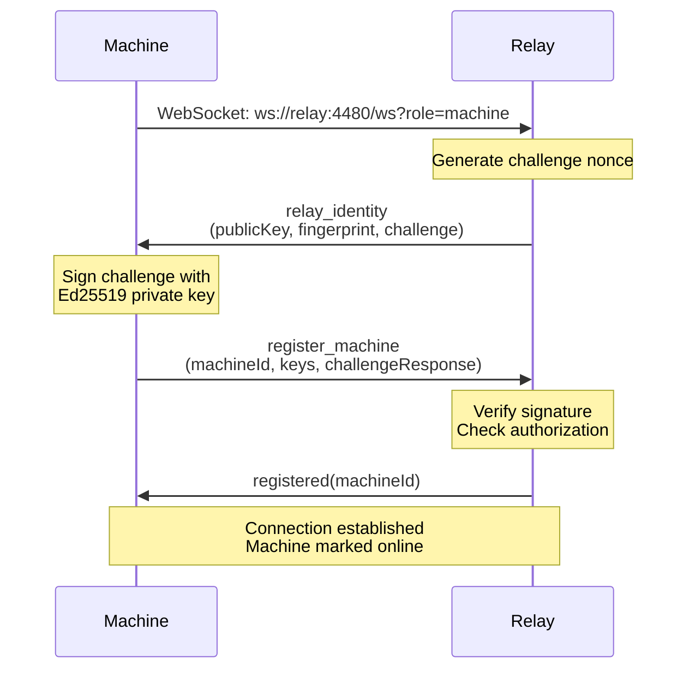
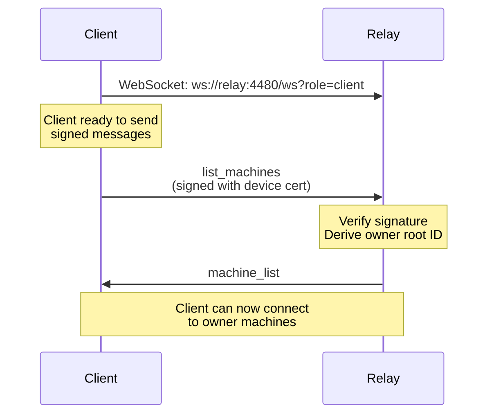
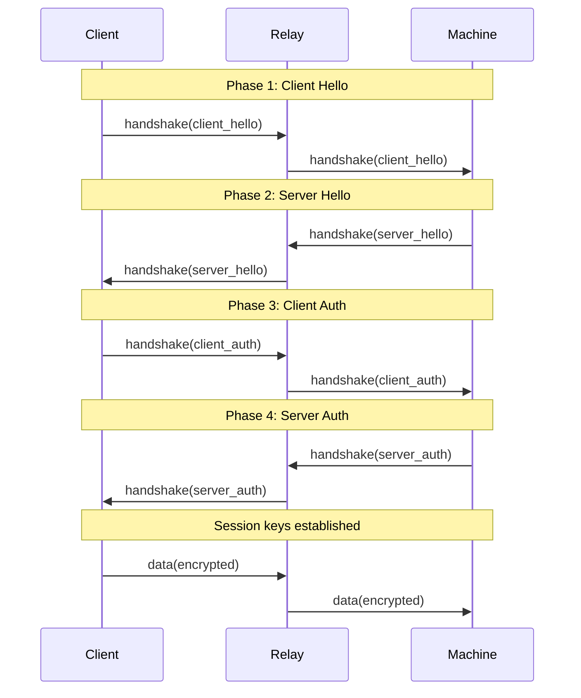
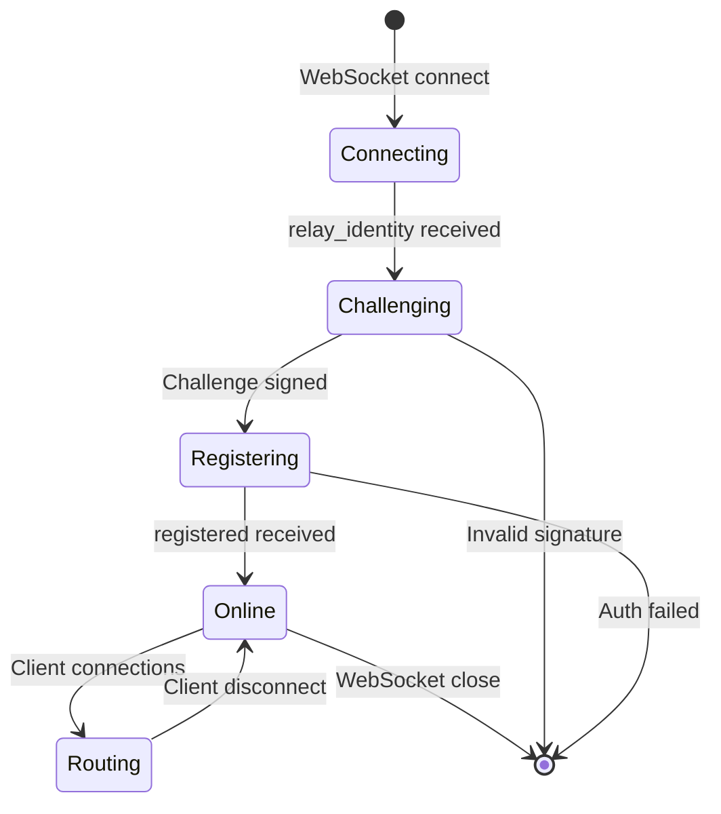
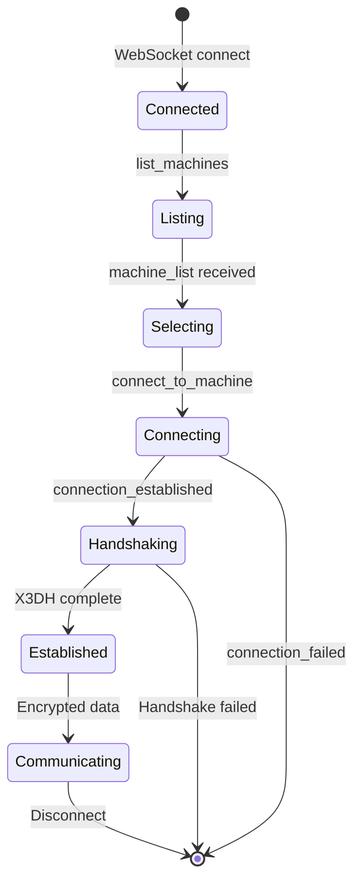

The GitSpace relay protocol defines how machines, clients, and the relay server communicate over WebSocket connections.

## Protocol Overview

The relay uses a JSON-based message protocol over WebSocket with three types of participants:

- **Machine** - Server running `gssh machine serve` (role=machine)
- **Client** - CLI or web client connecting to a machine (role=client)
- **Relay** - Routing server that forwards messages (role=router)

### Protocol Version

Current protocol version: **2**

- **Version 1**: Signatures optional (verify if present)
- **Version 2**: Signatures required on security-critical messages

```typescript
// src/relay/protocol.ts
export const PROTOCOL_VERSION = 2;
```

## Connection Establishment

### Machine Connection



### Client Connection



## Message Types

### Machine → Relay Messages

<Tabs>
  <Tab title="register_machine">
    Machine registers itself with the relay.

    ```typescript
    interface RegisterMachineMessage {
      type: "register_machine";
      machineId: string;
      signingKey: string;        // Ed25519 public key (base64)
      keyExchangeKey: string;    // X25519 public key (base64)
      label?: string;
      challengeResponse: string; // Signature of relay challenge (base64)
      protocolVersion?: number;
      enrollmentToken?: string;  // One-time invite token
      registerPermit?: string;   // Permit from unlock_grant
    }
    ```

    **Authentication**:
    - Must sign relay challenge with Ed25519 key
    - Must match enrollment authorization (invite or pre-authorized)
  </Tab>

  <Tab title="unlock_request">
    Machine requests identity unlock material using a one-time token.

    ```typescript
    interface UnlockRequestMessage {
      type: 'unlock_request';
      workspaceId: string;
      unlockToken: string;
      ephemeralKey: string; // X25519 public key (base64)
    }
    ```
  </Tab>

  <Tab title="data">
    Machine sends encrypted data to a specific client.

    ```typescript
    interface MachineDataMessage {
      type: "data";
      connectionId: string;  // Target client connection
      data: string;          // Base64 encoded encrypted frame
    }
    ```
  </Tab>
</Tabs>

### Client → Relay Messages

<Tabs>
  <Tab title="list_machines">
    Request list of machines the client can access.

    ```typescript
    interface ListMachinesMessage {
      type: "list_machines";
      clientIdentityId: string;
      deviceCertificate: string;  // JSON-serialized DeviceCertificate
      signature: SignatureBlock;  // Ed25519 signature
    }
    ```

    **Response**: `machine_list` with online/offline status
  </Tab>

  <Tab title="connect_to_machine">
    Connect to a specific machine.

    ```typescript
    interface ConnectToMachineMessage {
      type: "connect_to_machine";
      machineId: string;
      clientIdentityId: string;
      deviceCertificate: string;
      signature: SignatureBlock;
    }
    ```

    **Response**: `connection_established` or `connection_failed`
  </Tab>

  <Tab title="create_root_invite">
    Create a root-signed invite on the relay.

    ```typescript
    interface CreateRootInviteMessage {
      type: 'create_root_invite';
      clientIdentityId: string;
      deviceCertificate: string;
      inviteToken: string;        // Signed invite token
      signature: SignatureBlock;
    }
    ```
  </Tab>

  <Tab title="owner_sync_*">
    Configuration sync operations.

    ```typescript
    // Compare local vs relay revisions
    interface OwnerSyncCompareMessage {
      type: 'owner_sync_compare';
      clientIdentityId: string;
      deviceCertificate: string;
      localRevisions?: Partial<Record<SyncCategory, number>>;
      signature: SignatureBlock;
    }

    // Pull encrypted config records
    interface OwnerSyncPullMessage {
      type: 'owner_sync_pull';
      categories?: SyncCategory[];
      // ...
    }

    // Acquire global lock before push
    interface OwnerSyncLockMessage {
      type: 'owner_sync_lock';
      scope: 'global';
      writerId: string;
      ttlMs?: number;
      // ...
    }

    // Push encrypted config record
    interface OwnerSyncPushMessage {
      type: 'owner_sync_push';
      lockId: string;
      record: {
        category: SyncCategory;
        expectedRevision: number;
        ciphertext: string; // Encrypted payload (base64)
        checksum: string;
        // ...
      };
      // ...
    }
    ```
  </Tab>

  <Tab title="data">
    Client sends encrypted data to machine.

    ```typescript
    interface ClientDataMessage {
      type: "data";
      data: string; // Base64 encoded encrypted frame
    }
    ```
  </Tab>

  <Tab title="handshake">
    Client sends X3DH handshake message to machine.

    ```typescript
    interface ClientHandshakeMessage {
      type: "handshake";
      phase: "client_hello" | "client_auth";
      data: unknown; // X3DH message payload
    }
    ```
  </Tab>
</Tabs>

### Relay → Machine Messages

<Tabs>
  <Tab title="relay_identity">
    Relay identity and challenge nonce (sent immediately on connect).

    ```typescript
    interface RelayIdentityMessage {
      type: "relay_identity";
      publicKey: string;    // Relay's Ed25519 key (base64)
      fingerprint: string;  // Human-readable (e.g., "Kx4f:2nB9:mP3q:vR8s")
      label?: string;
      challenge: string;    // Nonce to sign (base64)
    }
    ```
  </Tab>

  <Tab title="registered">
    Registration confirmation.

    ```typescript
    interface RegisteredMessage {
      type: "registered";
      machineId: string;
    }
    ```
  </Tab>

  <Tab title="client_connected">
    Notification that a client connected.

    ```typescript
    interface ClientConnectedMessage {
      type: "client_connected";
      connectionId: string;
      clientIdentityId?: string;
    }
    ```
  </Tab>

  <Tab title="client_disconnected">
    Notification that a client disconnected.

    ```typescript
    interface ClientDisconnectedMessage {
      type: "client_disconnected";
      connectionId: string;
      reason: string;
    }
    ```
  </Tab>

  <Tab title="unlock_grant">
    Identity unlock material sealed for machine.

    ```typescript
    interface UnlockGrantMessage {
      type: 'unlock_grant';
      workspaceId: string;
      tokenId: string;
      registerPermit: string;     // Required for register_machine
      ciphertext: string;         // Sealed identity (base64)
      relayEphemeralKey: string;  // X25519 public key (base64)
      salt: string;               // HKDF salt (base64)
      expiresAt: string;          // ISO timestamp
    }
    ```
  </Tab>

  <Tab title="data">
    Encrypted data from a client.

    ```typescript
    interface DataFromClientMessage {
      type: "data";
      connectionId: string;
      data: string; // Base64 encoded encrypted frame
    }
    ```
  </Tab>
</Tabs>

### Relay → Client Messages

<Tabs>
  <Tab title="machine_list">
    List of machines the client can access.

    ```typescript
    interface MachineListMessage {
      type: "machine_list";
      machines: {
        machineId: string;
        label?: string;
        online: boolean;
        isAuthorized: boolean;
        accessType?: 'full';
        sessionId?: string;
        lastConnectedAt?: number;
      }[];
    }
    ```
  </Tab>

  <Tab title="connection_established">
    Connection to machine succeeded.

    ```typescript
    interface ConnectionEstablishedMessage {
      type: "connection_established";
      machineId: string;
      connectionId: string;
    }
    ```
  </Tab>

  <Tab title="connection_failed">
    Connection to machine failed.

    ```typescript
    interface ConnectionFailedMessage {
      type: "connection_failed";
      reason: string;
    }
    ```
  </Tab>

  <Tab title="root_invite_created">
    Root invite creation confirmation.

    ```typescript
    interface RootInviteCreatedMessage {
      type: 'root_invite_created';
      inviteId: string;
    }
    ```
  </Tab>

  <Tab title="owner_sync_*_result">
    Configuration sync operation results.

    ```typescript
    // Compare result
    interface OwnerSyncCompareResultMessage {
      type: 'owner_sync_compare_result';
      serverRevisions: Record<SyncCategory, number>;
      changedCategories: SyncCategory[];
    }

    // Pull result
    interface OwnerSyncPullResultMessage {
      type: 'owner_sync_pull_result';
      records: OwnerSyncRecordMessage[];
    }

    // Lock granted
    interface OwnerSyncLockGrantedMessage {
      type: 'owner_sync_lock_granted';
      scope: 'global';
      lockId: string;
      expiresAt: number;
    }

    // Push result
    interface OwnerSyncPushResultMessage {
      type: 'owner_sync_push_result';
      category: SyncCategory;
      revision: number;
      updatedAt: number;
    }
    ```
  </Tab>

  <Tab title="data">
    Encrypted data from machine.

    ```typescript
    interface DataFromMachineMessage {
      type: "data";
      data: string; // Base64 encoded encrypted frame
    }
    ```
  </Tab>
</Tabs>

### Error Messages

All errors use a standard format:

```typescript
interface ErrorMessage {
  type: "error";
  code: string;
  message: string;
}
```

**Error Codes**:

| Code | Meaning |
|------|----------|
| `INVALID_SIGNATURE` | Signature validation failed |
| `FORBIDDEN` | Caller is not owner for requested operation |
| `NOT_FOUND` | Machine/invite/record not found |
| `OFFLINE` | Target machine is not online |
| `INVALID` | Invite invalid, expired, or exhausted |
| `CONFLICT` | Expected revision mismatch (sync) |
| `LOCKED` | Owner lock held by different writer |

## Message Validation

### Security Validation

All messages undergo security validation:

```typescript
// src/relay/protocol.ts

// Maximum message size (1MB)
const MAX_MESSAGE_SIZE = 1024 * 1024;

// Maximum identifier length
const MAX_ID_LENGTH = 256;

// Valid identifier pattern (alphanumeric, hyphens, dots, colons)
const VALID_ID_PATTERN = /^[a-zA-Z0-9\-_.:+=\/]+$/;

// Valid base64 pattern
const VALID_BASE64_PATTERN = /^[a-zA-Z0-9+\/=\-_]+$/;

export function parseMessage(data: string | ArrayBuffer): ProtocolMessage | null {
  // Check size before parsing
  if (data.length > MAX_MESSAGE_SIZE) return null;
  
  const msg = JSON.parse(data);
  
  // Validate message-specific fields
  return validateMessageFields(msg);
}
```

<Warning>
The relay rejects messages that exceed size limits or contain invalid characters to prevent DoS attacks.
</Warning>

### Signature Verification

Security-critical messages must be signed:

```typescript
interface SignatureBlock {
  sig: string;  // Ed25519 signature (base64)
  pub: string;  // Ed25519 public key (base64)
  ts: number;   // Timestamp (Unix ms)
}

// All client → relay messages include:
interface SignedMessage {
  // ... message fields
  signature: SignatureBlock;
}
```

**Signature Validation**:

1. Extract signature, public key, and timestamp
2. Verify timestamp is within 5-minute skew tolerance
3. Reconstruct canonical message (without signature field)
4. Verify Ed25519 signature
5. Derive identity ID and check authorization

## Sync Categories

Configuration sync is organized into four categories:

```typescript
type SyncCategory =
  | "fundamental"      // Auth sessions, git credentials
  | "integrations"     // GitHub, Linear, Sprites settings
  | "project/workspace" // Projects, workspaces, bundles, secrets
  | "preferences";     // CLI and web preferences
```

### Sync Record Format

```typescript
interface OwnerSyncRecord {
  ownerUserRootId: string;
  category: SyncCategory;
  revision: number;        // Monotonic per category
  updatedAt: number;       // Unix ms
  writerId: string;        // Device identity ID
  checksum: string;        // SHA256 hex
  ciphertext: string;      // AES-256-GCM encrypted (base64)
}
```

### Sync Operations

<Steps>
  <Step title="Compare">
    Client sends local revisions, relay returns server revisions and changed categories.
  </Step>
  <Step title="Pull">
    Client pulls encrypted records for changed categories.
  </Step>
  <Step title="Lock">
    Client acquires global lock before modifying categories.
  </Step>
  <Step title="Push">
    Client pushes encrypted record with expected revision guard.
  </Step>
  <Step title="Unlock">
    Client releases lock after push completes.
  </Step>
</Steps>

<Note>
Push operations with stale `expectedRevision` are rejected with `CONFLICT` error, requiring the client to pull and merge first.
</Note>

## X3DH Handshake Over Relay

The relay routes X3DH handshake messages between client and machine:



<Accordion title="Handshake Message Format">
X3DH handshake messages are wrapped in the relay protocol:

```typescript
// Client → Relay → Machine
{
  type: "handshake",
  phase: "client_hello",
  data: {
    version: 1,
    ephemeralKey: "...",  // X25519 public key
    timestamp: 1234567890,
    clientNonce: "...",   // 32 bytes random
  }
}

// Machine → Relay → Client
{
  type: "handshake",
  phase: "server_hello",
  data: {
    version: 1,
    identityKey: "...",      // Ed25519 public key
    keyExchangeKey: "...",   // X25519 public key
    ephemeralKey: "...",     // X25519 ephemeral
    signedPreKey: "...",     // X25519 signed prekey
    preKeySignature: "...",  // Ed25519 signature
    serverNonce: "...",      // 32 bytes random
    timestamp: 1234567890,
  }
}
```
</Accordion>

## Data Routing

After handshake, encrypted data frames are routed:

### Client → Machine

```typescript
// Client encrypts with session send key
const frame = createFrame(MASTER_STREAM_ID, data, sessionKeys.sendKey);

// Send to relay
ws.send(JSON.stringify({
  type: "data",
  data: Buffer.from(frame).toString("base64"),
}));

// Relay forwards to machine
ws.send(JSON.stringify({
  type: "data",
  connectionId: "conn-123",
  data: "...", // Same base64 frame
}));
```

### Machine → Client

```typescript
// Machine encrypts with session send key
const frame = createFrame(MASTER_STREAM_ID, data, sessionKeys.sendKey);

// Send to relay
ws.send(JSON.stringify({
  type: "data",
  connectionId: "conn-123",
  data: Buffer.from(frame).toString("base64"),
}));

// Relay forwards to client
ws.send(JSON.stringify({
  type: "data",
  data: "...", // Same base64 frame
}));
```

<Note>
The relay cannot decrypt data frames. It only routes base64-encoded ciphertext between endpoints.
</Note>

## Connection Lifecycle

### Machine Lifecycle



### Client Lifecycle



## Implementation Files

Key protocol implementation files:

| File | Purpose |
|------|----------|
| `relay/protocol.ts` | Message types, validation, parsing |
| `relay/server.ts` | WebSocket server, routing logic |
| `relay/registries.ts` | Machine/invite/auth registries |
| `relay/jwt.ts` | JWT token creation/verification |
| `relay/pipes.ts` | Pipe abstraction for data routing |
| `lib/tmux-lite/relay-client.ts` | Client-side relay connection |
| `lib/tmux-lite/handshake-handler.ts` | X3DH over relay |

## Next Steps

<CardGroup cols={2}>
  <Card title="Encryption" icon="lock" href="/architecture/encryption">
    Learn about cryptographic protocols and key management
  </Card>
  <Card title="Architecture Overview" icon="sitemap" href="/architecture/overview">
    Return to the system architecture overview
  </Card>
  <Card title="CLI Reference" icon="book" href="/cli/project/add">
    Explore the complete CLI documentation
  </Card>
  <Card title="Development" icon="code" href="/advanced/development">
    Set up a development environment
  </Card>
</CardGroup>