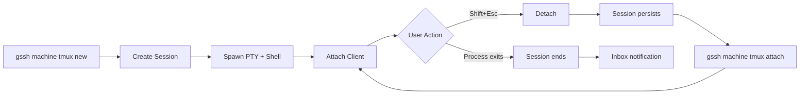

## What is tmux-lite?

tmux-lite is a lightweight terminal multiplexer built into GitSpace that enables persistent terminal sessions. Unlike traditional tmux, it's designed specifically for the GitSpace workflow with:

- **Single daemon** managing all sessions in one process
- **xterm-headless** for proper terminal state tracking
- **WebSocket protocol** for local and remote access
- **Notification system** for session events (exits, bells, title changes)
- **Detach/reattach** with full terminal state preservation

## Architecture

### Components

<Card title="Router Server" icon="server">
  Unix socket server (`/tmp/tmux-lite.sock`) that manages all sessions and routes commands
</Card>

<Card title="Session Server" icon="terminal">
  Each session has its own Unix socket for PTY I/O and control messages
</Card>

<Card title="CLI Client" icon="code">
  Command-line interface for creating, listing, and attaching to sessions
</Card>

### Session Lifecycle



## Protocol

### Frame Types

tmux-lite uses a binary framing protocol:

<ParamField path="PTY (0x01)" type="frame">
  Raw terminal output from the PTY
</ParamField>

<ParamField path="CONTROL (0x02)" type="frame">
  Control messages (resize, detach, attach-init, etc.)
</ParamField>

### Message Format

All frames use a 5-byte header:

```
┌─────────┬────────────┐
│  Type   │   Length   │
│ 1 byte  │  4 bytes   │
└─────────┴────────────┘
│      Payload         │
│   (variable)         │
└──────────────────────┘
```

- **Type**: `0x01` (PTY) or `0x02` (CONTROL)
- **Length**: 32-bit big-endian unsigned integer
- **Payload**: Raw bytes (PTY) or JSON (CONTROL)

## Session State

Each session maintains:

<ResponseField name="id" type="string">
  Unique session identifier (alphanumeric + hyphens/underscores)
</ResponseField>

<ResponseField name="name" type="string">
  Human-readable session name
</ResponseField>

<ResponseField name="cwd" type="string">
  Working directory where session was created
</ResponseField>

<ResponseField name="attached" type="boolean">
  Whether a client is currently attached
</ResponseField>

<ResponseField name="processTitle" type="string">
  Current process title (set via OSC 0 escape sequence)
</ResponseField>

<ResponseField name="exitCode" type="number | undefined">
  Exit code if session has terminated
</ResponseField>

<ResponseField name="createdAt" type="number">
  Timestamp (milliseconds since epoch)
</ResponseField>

<ResponseField name="socketPath" type="string">
  Unix socket path for this session
</ResponseField>

## Notifications (Inbox)

The inbox tracks events from detached sessions:

<ParamField path="exit" type="event">
  Session process exited (includes exit code)
</ParamField>

<ParamField path="bell" type="event">
  Terminal bell (BEL character or \x07)
</ParamField>

<ParamField path="title" type="event">
  Process title changed (OSC 0 or OSC 2)
</ParamField>

<ParamField path="idle" type="event">
  Session idle for configured threshold
</ParamField>

<ParamField path="osc" type="event">
  Custom OSC 777 notifications
</ParamField>

<Note>
  Notifications are only generated when detached. Configure via `~/gitspace/.config.json` → `notifications`.
</Note>

## Environment Variables

<ParamField path="TMUX_LITE" type="string">
  Set to session ID when inside a tmux-lite session
</ParamField>

<ParamField path="TMUX_LITE_SOCKET" type="string">
  Override router socket path (default: `/tmp/tmux-lite.sock`)
</ParamField>

<ParamField path="TMUX_LITE_SESSION_DIR" type="string">
  Override session socket directory (default: `/tmp`)
</ParamField>

<ParamField path="TMUX_LITE_PID_FILE" type="string">
  Override PID file location (default: `/tmp/tmux-lite.pid`)
</ParamField>

## Security

- **Session ID validation**: Prevents path traversal attacks
- **Unix socket permissions**: Only accessible by the user who started the daemon
- **No authentication**: tmux-lite is designed for local use only
- **Process isolation**: Each session runs in its own PTY with independent environment

<Warning>
  tmux-lite is **not** designed for multi-tenant or remote access. For remote terminal sessions, use `gssh client connect` instead.
</Warning>

## Comparison with tmux

| Feature | tmux-lite | tmux |
|---------|-----------|------|
| Windows/panes | No | Yes |
| Key bindings | Shift+Esc only | Full prefix system |
| Config file | No | Yes (~/.tmux.conf) |
| Scrollback | xterm-headless | Native |
| Notifications | Inbox system | Visual bell |
| Remote access | Via `gssh` relay | SSH forwarding |
| Use case | GitSpace workflow | General terminal multiplexing |

## Performance

- **Scrollback limit**: 10,000 lines per session
- **Max frame size**: 1 MB (512 KB chunks for PTY data)
- **Attach latency**: < 100ms (includes full state serialization)
- **Memory**: ~5 MB per session (includes xterm-headless buffer)

## Next Steps

<CardGroup cols={2}>
  <Card title="Commands" icon="terminal" href="/cli/tmux/commands">
    Learn all tmux-lite commands
  </Card>
  <Card title="Status" icon="chart-line" href="/cli/status">
    Check daemon status
  </Card>
</CardGroup>
